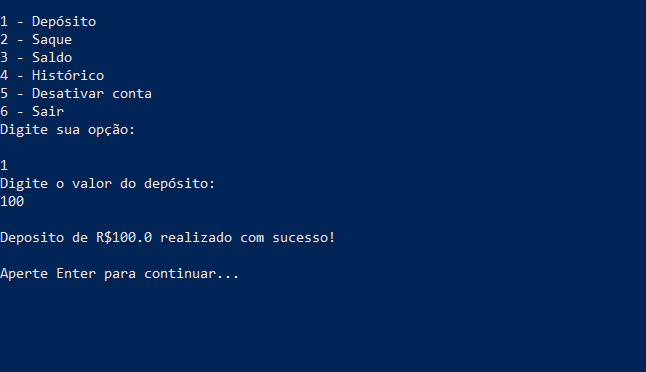

# Conta Corrente :atm:

## Sobre

Projeto simples desenvolvido em Java no NetBeans IDE durante uma atividade da faculdade, que simula ações de uma conta corrente. O intuito do trabalho é colocar em prática alguns conhecimentos de Programação Orientada a Objetos.

## Como utilizar

Windows: primeiramente você precisa ter o [Java](https://www.java.com/pt-BR/download/manual.jsp) instalado em sua máquina. Através do Prompt de Comando/PowerShell você deve ir para a pasta */dist* localizada dentro do projeto. Dentro da pasta, você deve rodar o comando *java -jar ContaCorrente.jar*. Após aberto, você irá informar um nome para a conta e logo após um menu será exibido. Para navegar pelo menu, basta selecionar uma das opções a seguir:

**1** para Depósito

**2** para Saque

**3** para Saldo

**4** para Histórico

**5** para Desativar conta

**6** para Sair

Para visualizar o projeto completo e seus arquivos, basta abrir o projeto no NetBeans IDE ou em outra IDE para projetos Java.